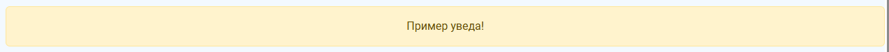
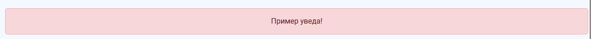
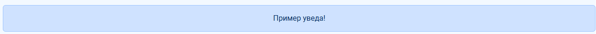
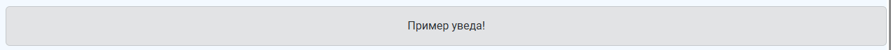

# FRONT
## Всплывающие уведомления

Пример кода отображения одного уведомления
```
          <div class="alert alert-success" role="success">
            Пример уведа!
          </div>
```

Отображение в системе: 


### Типы уведомлений в boostrap

1. alert-success


2. alert-warning


3. alert-danger


4. alert-info


5. alert-primary


6. alert-secondary


7. alert-light


8. alert-dark
